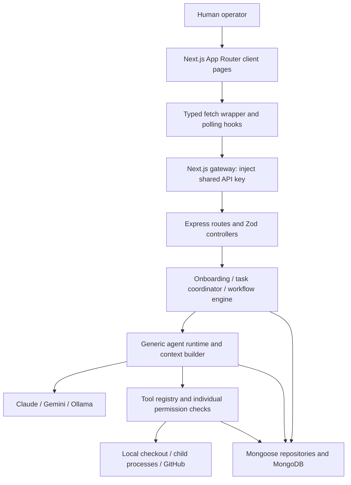

# SaaS Product Audit — AI Engineering Company

Audit date: 18 September 2026 · Source revision: `f923340`

> **Remediation status — 18 September 2026.** A first remediation pass has
> landed against this audit. See [REMEDIATION.md](REMEDIATION.md) for what was
> fixed, what was deliberately deferred, and which findings this document still
> describes accurately. The sections below are preserved as the original
> assessment and are **not** rewritten to match the current code.

## 1. Executive Summary

**This is an engineering MVP for a trusted operator, not yet a production SaaS.** It connects a repository, detects its stack, stores project memory, and coordinates six AI roles through feature development, bug fixing, and code review. Its most valuable assets are the separation between orchestration, tools, integrations, and persistence; inspectable workflow steps; and repository-specific context.

The credible commercial proposition is **turning a bounded engineering request into a reviewable, verified change, with remembered project conventions and controlled cost**. The likely initial buyer is a technical founder, engineering lead, or small agency maintaining existing GitHub repositories. This is a product hypothesis, not evidence of demand: the repository contains no customer research, conversion data, or measured output-quality results.

The current blockers are substantial:

1. **Access and execution safety:** the public Next.js gateway supplies the backend key without authenticating the caller. There are no users or tenant permissions. Agent terminal commands execute in the API host environment; file permissions have canonicalization gaps; indexing can include secret contents.
2. **Execution correctness:** runs execute inside HTTP requests; cancellation does not stop execution; concurrent requests can share a checkout; some failed or incomplete model results become successful steps. Persisted step records do not provide safe crash recovery by themselves.
3. **Unfinished customer outcome:** there is no dependable request-to-reviewed-PR journey, meaningful spend budget, customer billing, or first-run guidance. Technical activity is much more visible than delivered value.
4. **Release assurance:** there are no checked-in automated tests or CI workflow, the backend lint script is a placeholder, and a read-only dependency audit reports vulnerabilities, including critical findings against the locked Next.js version.

**Recommendation:** preserve Next.js, Express, MongoDB, the modular monolith, and the existing visual system. First secure and make one supported workflow dependable. Then add workspace identity, GitHub installation permissions, metering, and a capped paid pilot. Introduce infrastructure in response to execution and isolation requirements, not user-count ambition.

### Scope and confidence

- Inspected manifests, documentation, routes, principal screens, client hooks, controllers, orchestration/runtime, execution tools, onboarding, provider selection, all eight domain schemas, and their query repositories. Used targeted searches to trace related behavior; did not recursively read every file.
- Application code was not modified. No dependencies were installed; no application, database, paid model call, clone, push, or destructive security test was run.
- Neither `frontend/node_modules` nor `backend/node_modules` exists here. Build/typecheck, browser rendering, real integrations, accessibility interaction testing, and load testing remain **unverified**. UX findings below are implementation-based, not a claim of screenshot or usability testing.
- Ran `npm audit --package-lock-only --omit=dev --ignore-scripts --json` in both packages. Lockfiles were inspected only to establish the dependency versions implicated by this check.
- Ran two harmless local checks: the existing path helper accepts a raw frontend-prefixed path that resolves into `backend`; the native Response constructor rejects a nonempty body with status 204. These support specific findings below, not end-to-end exploit claims.
- **Confirmed** means visible in source or these checks. **Risk** identifies a plausible consequence whose deployed exploitability or frequency was not tested. **Proposal** identifies future behavior. Scale estimates and commercial assumptions are explicitly hypothetical.

## 2. What the Product Currently Does

The product attempts to operate an AI engineering team against existing code, rather than generate an unrelated new application. A human connects a repository and requests work; specialist roles retrieve context, call tools, and leave tasks, messages, decisions, and artifacts behind.

| Capability | What exists | Important boundary |
|---|---|---|
| Repository onboarding | GitHub cloning or server-local directory copying; static stack detection; file summaries and symbols; standing instructions | Synchronous; no customer GitHub installation flow; local paths refer to the server |
| Six roles | Project manager, engineering manager, backend engineer, frontend engineer, QA engineer, documentation engineer | Code-defined roles, not human team memberships |
| Three workflows | Feature development, bug fixing, code review | Sequential steps with prose output handoffs and regex skip conditions |
| Ad hoc work | Individual agent invocation; task creation, assignment, execution and status APIs | Some capabilities are API-only; `/org` can run an agent directly |
| Operator oversight | Run timeline, approval/resume/cancel controls, task board and drawer | Some controls do not enforce the behavior their labels imply |
| Memory | Weighted text retrieval, file ranking, architecture decisions, conventions, issue/change notes | No user-facing correction/version-governance workflow; freshness is weak |
| Git tools | Branch, commit, status/diff, registered push-and-open-PR tool | No standard publish step or normal built-in role using the `publish` bundle |
| Models | Claude SDK, Gemini REST, Ollama REST behind an interface | Global credentials and fallback selection; not tenant-configured routing |
| Usage visibility | Agent-wide token/tool/run totals; workflow step usage; estimated dollar display | Not an immutable, provider-aware billing ledger |

Evidence: [README](README.md), [API reference](docs/API.md), [workflow definitions](backend/src/workflows), [agent definitions](backend/src/agents/definitions), [tool bundles](backend/src/tools/bundles.ts), [provider registry](backend/src/services/llm/provider-registry.ts).

**Maturity: MVP, with prototype-level production controls.** There are real database writes, model integrations, repository mutations, error types, health routes, and reusable UI components. However, no account or billing lifecycle exists, critical controls are incomplete, and no automated acceptance evidence accompanies the claimed autonomous workflow. Documentation describes intended guarantees more strongly than implementation warrants.

## 3. Current Architecture

### Frontend

- Next.js App Router, React 19, strict TypeScript, Tailwind 4. Root layout is a server component; all principal pages and the application shell are client components. Client context is not itself a problem for this interactive workbench, but initial data is fetched after hydration.
- Routes: `/` Command Center, `/projects`, `/projects/[id]`, `/runs`, `/runs/[id]`, `/org`, `/pipeline`. The last two explain agent capabilities and internal data flow; there are no login, organization, billing, or account-settings routes.
- [api.ts](frontend/lib/api.ts) wraps same-origin fetch to `/api/gateway`, parses errors, and casts responses to duplicated frontend interfaces. [hooks.ts](frontend/lib/hooks.ts) implements polling, localStorage preferences, and mutation state. No shared server-data cache, query deduplication, or cross-screen invalidation exists.
- The [gateway](frontend/app/api/gateway/[...path]/route.ts) forwards GET/POST/PATCH/DELETE, injects a server-only key, and disables fetch caching. It does not authenticate users, propagate a verified actor, enforce permissions, or impose a body/operation allowlist.

### Backend

- Express assembly is separated from bootstrap: [app.ts](backend/src/app.ts), [server.ts](backend/src/server.ts). Middleware includes Helmet, reflective credentialed CORS, a 5 MB JSON parser, Pino request logging, and centralized errors.
- [routes/index.ts](backend/src/api/routes/index.ts) groups projects, tasks, agents, workflows and health under unversioned `/api`. Controllers delegate most work to services or repositories.
- Business execution is separated into onboarding, task routing/coordinating, workflow engine, agent runtime, context/memory, tools, and integrations. Keep these boundaries.
- Agent loops, cloning, indexing, and commands run within the backend process lifecycle. No durable work queue, worker lease, scheduler, execution isolation service, distributed limiter, or event streaming exists.
- Database access uses Mongoose repositories and predominantly `.lean()`. One connection pool per process, maximum 20 connections, is configured in [connection.ts](backend/src/database/connection.ts). Indexes are explicitly created at startup, even though production `autoIndex` is disabled.

### Identity, tenancy and integrations

Authentication is an optional shared `PLATFORM_API_KEY`; an unset key bypasses authentication, including in production. There are no passwords, sessions, JWTs, users, memberships or customer roles. A `projectId` groups data but is **not an authorization boundary**. Client-supplied `startedBy`/`approvedBy` strings are labels, not verified identities.

External dependencies are Anthropic, Google Gemini, optional Ollama, GitHub/Octokit, local Git and executables, and MongoDB. There is no payment provider, email service, object store, product analytics integration or error-monitoring service wired into the application. Stripe appears in example user requests, not monetization code.

### Deployment assumptions

[docker-compose.yml](docker-compose.yml) deploys MongoDB 7 and the backend only, with named database/workspace volumes. The backend port is published; MongoDB is not published to the host but has no configured database authentication. The [Dockerfile](backend/Dockerfile) uses a multi-stage Node 22 Alpine build, `npm ci`, a non-root user, Git and tini: useful foundations. It does not isolate one repository from another or provide the Python/Java/.NET toolchains the product claims to detect.

There is no frontend deployment manifest, TLS/reverse-proxy configuration, backup job, restore procedure, staging environment or CI definition in the inspected repository. Compose does not pass the Gemini/Ollama/provider-selection variables present in examples. `localhost:11434` inside its backend container would not address an Ollama instance on the host. Actual hosting outside the repository is unknown.

## 4. Current User Journeys

| Journey | Current path | Main friction or defect |
|---|---|---|
| First visit | Command Center → connect CTA → Projects | Many architecture charts before first value; no account/onboarding checklist or supported-environment explanation |
| Connect repository | URL/local path + optional branch/instructions → wait → project list refresh | No stage-specific progress, resumable setup, GitHub consent flow or guided next action; shorthand URL is parsed but raw shorthand is passed to Git clone |
| Inspect codebase | Project → overview/memory/tasks/messages/data-flow tabs | Useful context; no launch action scoped directly to this project, and hidden tabs still poll |
| Commission work | Dashboard/Runs → choose ready project and workflow → describe request → wait | Run ID/navigation arrive only when execution finishes or pauses; no budget or change-scope approval preview |
| Review progress | Run detail → timeline → step output → task drawer | Text reports dominate; no authoritative base-to-head diff, test-verdict summary or guaranteed PR deliverable |
| Handle approval/failure | Approve step or Resume; task-level Approve/Run | Approval policies differ by entry point; task approval cannot satisfy a role gate; resume can duplicate work |
| Stop work | Cancel on run detail | Stored status changes, but live agent/command execution continues and may later overwrite cancellation |
| Ask one role | Org → agent panel → prompt → result | Direct runtime path bypasses workflow approvals and has no durable standalone execution record when no task is supplied |
| Remove project | DELETE API and client helper | No surfaced disconnect UI found; deletes checkout and knowledge/project only, leaving other records; gateway mishandles 204 |

### Proposed first-value journey

Sign in → create a workspace → authorize selected GitHub repositories → connect one supported repository → confirm detected source roots/test command and data-processing policy → choose a bounded review or small fix → inspect scope and budget cap → launch → immediately see a durable run page → review evidence and diff → explicitly approve publication of a draft PR → observe CI and human outcome.

For an initial review, use a genuinely enforced inspection-only tool set; the existing code-review workflow uses QA and documentation roles with write capability. Offer a seeded sample repository for exploration. Keep the first-run scope narrow enough to finish and assess in one session; measure the latency before promising a time guarantee.

## 5. Product Strengths

1. **Repository-specific context is a plausible retention asset.** Stack profiles, standing orders, decision records and retrieval can reduce repeated explanation across runs. Preserve [memory](backend/src/memory) and improve provenance/freshness before introducing new retrieval infrastructure.
2. **Work is inspectable.** Steps, tasks, history, command artifacts and messages provide an excellent basis for review and support. Preserve the timeline and drawer rather than replacing them with a chat-only interface.
3. **The architecture is understandable.** Controllers, repositories, definitions, provider adapters and tools have useful seams. `createApp()` and explicit tool context facilitate testing, although some orchestration singletons still need injection seams.
4. **Safety mechanisms already have places to live.** Permission definitions, lexical/realpath containment, a secret deny list, approval states, output limits and iteration caps are valuable starting points. Their existence is not proof that all access paths enforce them.
5. **The UI has a coherent visual language.** Reusable cards/fields, design tokens, dark mode, responsive grids, loading states, and status text plus glyphs are worth keeping. Some SVG charts have accessible names and CSS includes partial reduced-motion handling.
6. **The product supports human judgment.** Plans, architecture reviews, QA findings and accepted conventions can differentiate it from a simple code-generation button once the platform verifies the claims it displays.

## 6. Product Weaknesses

- **Outcome ambiguity:** “workflow completed” currently means the engine traversed steps, not that acceptance criteria passed or a human accepted a change. This undermines willingness to pay.
- **Incomplete delivery loop:** branch creation is model-directed; no workflow owns an immutable base commit, consolidated change set, publish approval and resulting PR. GitHub PR helper methods exist but are not wired into normal review intake.
- **Overbroad positioning:** detection supports many languages, but execution images, cwd/test commands and role paths do not guarantee support. For example, the backend role lacks `backend/**`, while frontend `app/**` can include server-side Next routes. Sell tested repository layouts first.
- **Duplicate work representations:** the planning prompt creates backlog tasks, while each workflow step separately creates its own task. The engine does not reconcile these, so “done” runs can leave executable planning tasks behind.
- **Weak recovery and actionability:** no dependable cancel/retry contract, no reply-and-resume UI for human escalations, no export, and no observed CI feedback loop.
- **Commercial invisibility:** no customer accounts, plans, entitlements, purchase path or evidence of value delivered; global token totals are not customer economics.
- **Documentation overstates guarantees:** examples say missing Claude credentials prevent boot, but Ollama is always considered configured; comments promise process-group termination but code kills one child; comments promise polling backoff but run detail uses a fixed interval. Update assertions after behavioral tests.

## 7. Feature Opportunities

Complexity is implementation effort, not attractiveness. Priorities map to roadmap items in section 20. Basic safety and accurate evidence belong in every plan.

| Opportunity | User problem solved | Business value | Complexity | Dependencies | Priority |
|---|---|---|---|---|---|
| F1. Verified change package and draft PR | “What changed, does it pass, and can I safely merge it?” | Makes delivered work tangible; supports repeat paid use | Large | Execution correctness, isolated checkout, base/head tracking, scoped GitHub access, test results | P1, R12/R18 |
| F2. Durable run controls with explicit spend cap | Long waits, duplicate runs, uncertain cancellation and surprise cost | Trust, lower support burden, sustainable margins | Large | R02/R04/R05/R07; metering and usage reservation | P0 foundation; R20 customer controls |
| F3. Guided repository onboarding and supported-stack recipes | Token/configuration friction and incorrect detected commands | Higher activation and lower time-to-value | Medium | Safe import, async job contract, validated source roots; GitHub installation later | P1, R11/R17 |
| F4. Resolve human questions in the run | Users can see an escalation but cannot complete the conversation | Fewer abandoned runs and more successful changes | Medium | Actor identity, contextual message/thread, checkpoint/resume | P1, R15/R19 |
| F5. Shared workspace with request/review/approve roles | Teams need accountability without sharing an all-powerful key | Enables team adoption and pooled spend | Large | Tenant ownership migration, server permissions, invitations | P1; mandatory before shared hosting, R16 |
| F6. Reviewable, current project memory | Incorrect/stale decisions can contaminate every future run | Repository-specific differentiation and retention | Medium | Provenance, base SHA, accepted/proposed distinction, correction audit | P1 core; P2 advanced, R14/R24 |
| F7. GitHub issue/PR intake with CI and merge feedback | Users must re-enter context and manually check outcomes | Fits existing engineering work and measures real value | Medium | F1, installation webhooks, deduplication, permissions | P2, R23 |
| F8. Completion/approval notifications and quiet digests | Work takes minutes; users should not watch polling dashboards | Faster approvals and useful return visits | Medium | Durable events, user preferences, safe email links, delivery retries | P2, R25 |
| F9. Reusable bounded maintenance jobs | Repeated chores require the same setup each time | Recurring usage; premium automation with clear value | Medium initially; Large with scheduling | Validated recipes, spend caps, isolated workers, idempotency | P2, R26 |
| F10. Budget-aware model choices | A costly six-role workflow may be unnecessary for a small review | Better unit economics and predictable choice | Medium | Provider contract tests, quality evaluations, accurate model/cost records | P2, R27 |

Validate F1–F3 with approximately five design partners maintaining real but noncritical repositories. Compare human review effort and accepted output across small fixes and reviews. Do not advertise “autonomous company” performance based on agent count or generated tokens.

## 8. UI/UX Audit

| Area | Evidence and current issue | Specific improvement | Timing |
|---|---|---|---|
| Information architecture | [AppShell](frontend/components/shell/AppShell.tsx): Org and Data Pipeline are primary navigation | Prioritize Overview, Projects, Runs, Needs Review; move explanatory architecture views under “How it works” or operator diagnostics | Soon |
| First use | [Command Center](frontend/app/page.tsx) retains a large operational dashboard before any project exists | Show a three-step setup checklist, sample repository, privacy explanation, and one recommended first task | Soon |
| Dashboard usefulness | Counts derive from limited list responses; global agent usage remains global under project selection; attention items can double-count related failures | Display scoped summaries, awaiting-decision actions, recent accepted work, and spend; distinguish exact totals from “recent” counts | Now/Soon |
| Next action | Attention tasks are plain text; project overview lacks an obvious scoped launch CTA | Link directly to the relevant task/run and offer “Start work in this project”; make selected scope explicit | Soon |
| Launch feedback | [RunLauncher](frontend/components/panels/RunLauncher.tsx): submission waits for completion | Return an accepted run immediately, navigate to it, preserve the prompt, show queued/running state, heartbeat and budget | Now |
| Scope correctness | Launcher copies `defaultProjectId` into state once; changing outer selection need not change it | Make selection controlled or reconcile it deliberately, clear deleted/unready choices, confirm repository and branch near submission | Now |
| Onboarding | [ConnectProject](frontend/components/panels/ConnectProject.tsx): vague validation and server-local path example | Field-specific URL/branch errors, preflight permissions, stage progress, recoverable failed import, success link and “Run first review” | Soon |
| Loading/errors | Shared Spinner/EmptyState/ErrorNote exist; several secondary fetch failures leave skeletons indefinitely; reanalysis error is not displayed | Give every panel retry/error/stale-data states; retain last successful data with a timestamp; show mutation errors without dismissing the panel | Now |
| Live status | AppShell's indicator pulses on a timer, regardless of fetch success | Derive freshness from successful requests; show reconnecting/offline/stale explicitly | Now |
| Run duration | [run page](frontend/app/runs/[id]/page.tsx): line 61 passes `undefined` as end time for every state | Include API timestamps in frontend types and freeze elapsed time on all terminal states | Now |
| Output review | [ui.tsx](frontend/components/ui.tsx) shows raw preformatted output; its “copy affordance” comment has no copy button | Lead with outcome, changed files, verification and risks; add copy/download; use a sanitized renderer if adding Markdown | Soon |
| Forms | Field wraps controls in labels, which is good; primary flows lack semantic forms and aligned server bounds | Use form submit, trim validation, min/max lengths, field errors, `aria-describedby`/`aria-invalid`, and announced submission status | Soon |
| Drawers and tabs | Task drawer lacks dialog role, focus trap, Escape handling and return-focus; project tabs lack tab semantics | Use an accessible dialog primitive and keyboard-operable tablist or ordinary links with URL state; expose close-button accessible name | Soon |
| Charts/accessibility | SVG role names exist, but interactive agent nodes and hover details are mouse-oriented; some selects have no labels | Provide equivalent list/table actions, keyboard interaction, visible focus, `aria-current`, labelled filters and announcements | Soon |
| Small screens | Mobile navigation is glyph-only; five project tabs do not wrap; board columns are fixed 240 px and horizontally scroll | Add labelled mobile navigation, scrollable tab affordance and a compact task list; verify at 360/390/768 px and keyboard zoom | Soon |
| Contrast/hierarchy | Many labels are 9–11 px; bright series/status colors are used as small text; contrast is unmeasured | Raise essential metadata to readable sizes, use darker text variants and test both themes; retain glyph/text redundancy | Soon |
| Destructive actions | Cancel has no explanation of residual changes; disconnect is not surfaced | Make stop semantics accurate first; add confirmation explaining retained artifacts; offer archive/export before permanent deletion | Now/Soon |
| Search/filtering | Memory/message filters act only on loaded records; project/run/task search is absent | Introduce server pagination and explicit scope, then status/date/assignee filters and search; persist filters in URL | Soon |

The professionalism gap is primarily behavioral: a commercial UI must accurately explain what is happening, what was achieved, and what the user should do next. Keep the present design tokens and component vocabulary.

## 9. Frontend Engineering Audit

- **Rendering:** keep interactive execution panels client-side. Server-render initial project/run summaries where it removes hydration waterfalls; keep authentication and secret-bearing operations server-side. A client shell around server children does not automatically turn every descendant into a client component. Do not rewrite all pages as server components without measuring benefit.
- **Polling:** [usePoll](frontend/lib/hooks.ts):21 skips hidden tabs, which is good, but `setInterval` allows overlapping requests and older responses can overwrite newer ones. Cleanup prevents state writes but does not abort network work. There is no backoff, shared cache or focus refresh; dependency changes retain old data until the new response. Add AbortSignal, one in-flight request per key, stale/error timestamps and active-state intervals.
- **Traffic:** Command Center plus shell makes approximately `1/10 + 1/8 + 1/4 + 1/4 + 1/5 + 1/15 = 0.992` requests/second per visible tab, excluding initial loads. Run detail polls every 2.5 seconds even after completion. Project detail polls tasks, messages and memory while other tabs are active.
- **State:** use URL state for shared project/tab/filter scope; localStorage is appropriate for a preference, not an authorization or source-of-truth layer. [useAction](frontend/lib/hooks.ts):102 captures the initial function in an empty-dependency callback; its current API function call sites are mostly stable, but future closures can become stale. It also returns `null` on error. TaskDrawer closes after both success and failure, hiding the error.
- **Data contracts:** frontend interfaces duplicate backend types and omit run `startedAt`/`completedAt`. A generic `payload as T` does not validate responses. Share transport schemas or generate DTOs from maintained contracts, keeping Mongoose/internal paths out of browser responses. Stronger contracts are more urgent than a new global state library.
- **Gateway correctness:** line 45 constructs a body even for a 204. A successful DELETE can therefore produce a gateway error after the deletion has happened. Return `null` for no-body statuses. Forward request correlation IDs, selected safe response headers, and actionable but noninternal errors. The gateway's 300-second hosting hint conflicts with provider calls that may last 600 seconds individually.
- **Caching/invalidation:** static workflow/role definitions can be cached separately from changing stats; sensitive tenant data requires scoped cache keys. Refresh run/tasks/usage coherently after mutation. Start with repairing the hook; adopt a small query library only if it reduces duplicated lifecycle code. Never optimistically mark a run completed, approved or deleted; optimistic draft editing is safer with rollback.
- **Error containment:** no route-level `error.tsx`, `loading.tsx`, or `not-found.tsx` was found. Add route boundaries and explicit invalid-ID/not-found behavior; avoid turning one panel failure into a blank workbench.
- **Performance:** small direct dependency surface and hand-written SVGs are advantages. Charts and unused project tabs are eagerly imported; defer nonessential diagnostics when measurements justify it. No image-heavy path was found, so image optimization work is not a product priority. Bundle size, Core Web Vitals and actual hydration cost were not measured.
- **Maintainability/testing:** preserve the API wrapper, design tokens and reusable primitives. Extend Button to accept normal accessibility/HTML props; extract shared page data policies. Strict TS exists, but no real lint or UI test harness is present.

Protect route handlers and data access, not just page navigation; this matches the [Next.js authentication guidance](https://nextjs.org/docs/app/guides/authentication).

## 10. Backend Engineering Audit

### Confirmed execution defects

| ID | Finding and trigger | Evidence | Required behavior |
|---|---|---|---|
| E1 | Cancel changes a record but running steps continue, and final completion can overwrite it | [engine.ts](backend/src/workflows/engine.ts):112, 125–177 | Persist cancel request, abort model calls/process trees, check cancellation before every effect, acknowledge stopped only after worker confirmation |
| E2 | Refusal/truncation/iteration-limit results and `needs_review` can be treated as completed steps; only `blocked` is considered | engine:215–253; [runtime](backend/src/agents/agent-runtime.ts):159–241 | Typed terminal outcomes, explicit review state, required evidence and machine-verifiable check results |
| E3 | Concurrent task starts race even in one Node process because read/check/update are separated by awaits; run resume has no claim | [coordinator](backend/src/orchestrator/agent-coordinator.ts):30–60; engine:77–84; [task repository](backend/src/database/repositories/task.repository.ts):59 | Atomic compare-and-set claims, leases/fencing, idempotency keys, per-checkout ownership |
| E4 | Work continues in request memory; restart loses the conversation and can replay partially completed side effects | workflow controller:45–48; engine:194–213; runtime:115 | Durable attempts/checkpoints, external worker, recovery reconciliation, idempotent publication |
| E5 | Same project shares a checkout across separate requests/runs/tasks; sequential steps within one run do not prevent collisions | Workspace.pathForProject; runtime:64; engine comments versus no project lock | Serialize all access now; isolate runs and pin base commits before parallelism |
| E6 | Task approval only sets ready; a role requiring approval would gate again on the next run. Global approval is only checked by the workflow engine; direct agent execution bypasses it | coordinator:43–56, 199–205; agent controller:65–76 | One execution authorization policy shared by all entry points, durable scoped approval receipts |
| E7 | Dependencies and scheduling are inconsistent: direct run does not check dependencies; missing dependency IDs count as zero blockers; priority sorts alphabetically; dependency-free candidates skip the limit check | task controller:86; task repository:118–141 | Validate dependency ownership/existence, numeric priority rank, enforce limits in every path, batch dependency reads |
| E8 | PR/review evidence is unreliable: commit artifact requests working-tree diff after commit; QA starts with unstaged diff; base comparison helper is not exposed | [git.tool.ts](backend/src/tools/git.tool.ts):124–128; QA definition; GitManager.diffAgainst | Record base/head commit IDs and collect complete committed plus relevant uncommitted diff; validate staged contents before commit |

### Other backend findings

- API resource structure, async error forwarding, Zod request validation and domain error envelopes are sound starting points. Split the router as it grows; avoid a premature service split.
- Validate ObjectIds, enums, string sizes and object relationships consistently. Some reads treat bad IDs as 404; create/filter paths can raise uncaught cast errors and become 500. Duplicate key, malformed JSON and oversized body errors also need deliberate mappings. Use 400/404/409/413/429 consistently.
- Runtime JSON tool schemas are sent to the model but not validated before execution; TypeScript interfaces disappear at runtime. Centralize schema validation, role tool membership, authorization and resource limits before dispatch.
- `runTask` can rerun cancelled/failed work without a validated transition graph. Retrying does not reliably clear stale error/completion timestamps. Workflow retry creates another task and replaces the step's task reference, without explicit attempt lineage.
- Agent result usage is aggregated only at the end; thrown mid-run failures lose accumulated usage from durable accounting. Ad hoc runs without tasks leave no complete execution record. Record every provider response and attempted effect independently of success.
- Onboarding needs async states, cleanup, byte/time quotas and safe retry. Reanalysis sets `analyzing` without its own failure transition; a failed reanalysis can leave that state indefinitely.
- Messages are persistent records, not a reliable delivery queue. Inbox reads mark messages consumed before model execution succeeds. There is no event that automatically schedules the recipient or resumes a blocked task. Distinguish informational messages from actionable human requests with acknowledged resolution.
- Provider abstractions are worth retaining. Claude config has SDK retries; Gemini/Ollama have explicit 10-minute fetch timeouts but no shared bounded retry policy. Add per-provider concurrency, retry classification, cancellation and a total run deadline. Validate configured model/effort combinations through contract tests; no live model availability was verified here.
- No rate limiter, admission quota or CPU/disk/memory budget exists. Iteration/tool count caps alone do not control aggregate cost or resource exhaustion.
- Introduce `/api/v1` when external customer API access becomes a product promise; changing the internal gateway prefix immediately has little user value. There is no file-upload endpoint; the main file risks are imports, generated files, logs and workspace storage.

## 11. Database Audit

### Model map

All eight schemas use timestamps and explicit collection names. References express relationships but do not enforce ownership or referential integrity.

| Collection | Relationships and shape | Assessment |
|---|---|---|
| `projects` | Embedded profile; optional repository reference; absolute workspace path; globally unique name | Good bounded profile embedding; needs tenant ownership and public DTO; global name uniqueness blocks unrelated customers using the same name |
| `repositories` | `projectId`, VCS metadata, clone path, embedded full `fileIndex` | Intended one per project but index is not unique; potentially very large document |
| `tasks` | Project/run/dependency references; embedded acceptance criteria, artifacts and history | Good inspectability; artifacts/history and model-authored text lack aggregate bounds |
| `workflow_runs` | Project reference; embedded small step list, outputs and context | Bounded predefined steps are sensible; add immutable workflow version and attempt/claim metadata |
| `messages` | Project/task/run references, from/to, text, optional payload/readAt | Suitable event-shaped data; needs retention, actionable-message lifecycle and ownership checks |
| `knowledge` | Project/task references, kinds, content/tags/paths/confidence/supersession | Useful lexical retrieval; no unique upsert identity; validation weaker on updates |
| `decisions` | Project/task, rationale, alternatives, status and supersession | Useful separate lifecycle; proposed decisions are currently returned then described as binding accepted decisions |
| `agents` | Global definitions/stats and optional project overrides; unique `(key, projectId)` | Global hot counters are not billing; `findEffective` exists but runtime reads the code registry, so stored overrides are not effective behavior |

Schema sources: [models](backend/src/database/models). Query sources: [repositories](backend/src/database/repositories).

### Query and index plan

Use sampled `explain('executionStats')` against realistic data before adding performance indexes. The following proposals follow observed filters/sorts; tenancy must be added to query contracts and indexes together. Unique constraints enforce correctness even at low volume. Preserve the existing `(projectId, createdAt desc)` task/run/message indexes.

| Actual query | Current support/gap | Candidate change and timing |
|---|---|---|
| Project list sorted by creation; findByName | Global unique name, no creation-sort index | At tenancy migration: unique `(workspaceId, normalizedName)` and list `(workspaceId, createdAt:-1, _id:-1)`; backfill and deduplicate first |
| Repository lookup by project | Nonunique `projectId` index | Make intended one-repository-per-project unique after duplicate checks; tenant-prefix if queries carry workspace ID |
| Knowledge upsert by project/kind/title | `(projectId, kind, updatedAt)` does not enforce identity | Unique `(projectId, kind, title)` now if titles remain the upsert identity; use a stable `key` if human renaming is introduced |
| Task list by project sorted newest | Existing compound index is appropriate | Add `_id` tiebreaker with cursor pagination; add status/assignee variants only for measured frequent filters |
| Tasks by workflowRunId sorted newest | Single-field run index only | Candidate `(workflowRunId, createdAt:-1, _id:-1)` for run-detail task pages; project/workspace must be authorized first |
| Runnable tasks by project/status/priority/creation | Existing priority string index is semantically wrong for urgency; missing creation field | Replace priority with numeric rank, then evaluate `(projectId, status, priorityRank:-1, createdAt:1)` or a ready-only queue index against actual claim query |
| Agent inbox by project/to/unread, newest-first | Separate project and `(to, readAt)` indexes | Candidate `(projectId, to, readAt, createdAt:-1)`; measure unread representation/selectivity before choosing partial indexing |
| Task message thread oldest-first | Single-field taskId index | Candidate `(taskId, createdAt:1, _id:1)`; fetch recent page then order for display, rather than permanently limiting to earliest 50 |
| Active knowledge by project sorted update | Existing kind-between-project-and-sort index helps when kind is specified, less so for all kinds | Evaluate `(projectId, updatedAt:-1, _id:-1)` for memory list; retain weighted text index initially |
| Knowledge path recall | `paths` has no matching compound index | Add `(projectId, paths)` only if measured retrieval cost warrants it; tenant equality scope on text search is a later migration, not a second text index |
| Accepted/proposed decisions by project newest | Existing project/creation index is reasonable | Fix semantic filtering first; add a status variant only with evidence |

Index order matters for equality and sort support; validate the candidate plans rather than adding every permutation. See [MongoDB compound index guidance](https://www.mongodb.com/docs/manual/core/indexes/index-types/index-compound/).

### Data correctness and growth risks

- **Large embedded arrays:** indexing stops at 20,000 walked files, but document byte size and path/symbol lengths are not capped. A repository index can approach MongoDB's 16 MiB document limit. Set measured byte limits now; move file records into `(repositoryId, commitSha, path)` documents when needed. Task history/artifacts grow across retries and manual operations; move large output blobs to object storage and append-only events as volume warrants. Small step arrays should stay embedded. [MongoDB document limit](https://www.mongodb.com/docs/v8.0/core/document/).
- **Heavy projections:** list endpoints return full task artifacts/history and run context/outputs; project detail loads the full repository document just to return its index length. Add lightweight list projections and persisted file counts. File retrieval loads/ranks the whole index on each agent start and `find_files`; cache by repository/commit only after correctness and secret filtering.
- **Pagination:** projects/runs cap at 50, tasks/messages at 100, knowledge at 200, decisions at 50; there is no cursor. `count` is often the returned page length. Do not describe it as total or use it for billing/entitlements. Expose `items`, `nextCursor`, `hasMore`; provide a separate scoped aggregate for dashboard counts.
- **N+1:** `findRunnable` issues a dependency count per candidate; context builder reads each dependency separately. Batch by project and IDs; detect missing dependencies and cycles. Current count aggregations are simple project-scoped groups, not intrinsically expensive multi-collection joins, but repeated polling still costs work.
- **Partial state changes:** run/task creation, decision supersession, onboarding, deletion and approval span multiple writes. Use conditional atomic updates; use transactions for true multi-document invariants where appropriate, and idempotent recovery for filesystem/Git effects. Current standalone Compose MongoDB is not a replica-set transaction deployment.
- **Deletion is incomplete:** disconnect removes checkout, knowledge and project but leaves repositories, tasks, runs, messages and decisions. It does not stop active work and removes local-only work. Introduce archive → stop/drain → export opportunity → idempotent purge/tombstone. Track deletion across DB, artifacts, credentials and backups' expiry policy.
- **Validation/history:** ODM updates generally omit `runValidators`; many fields have no length/array limit. Add domain-level bounds and transition constraints. Task history is useful but not an immutable actor-authenticated audit log. Separate approval/security events from mutable operational records.
- **Memory correctness:** proposed and accepted decisions are both injected as binding; only the latest ten are retrieved. Superseded knowledge is excluded from lists but included by count aggregation. Reindexing replaces an entire file index and does not guarantee removal/supersession of stale seeded facts. Establish versioned, tested semantics before extending retrieval.

**MongoDB remains appropriate.** Document-shaped profiles, runs, tasks, messages and memory fit it. Correct scoping, atomic claims, bounded documents and usage ledgers solve the demonstrated problems without a database migration.

## 12. Security Audit

Severity below assumes the service is reachable by untrusted users. No compromise was observed or attempted. A deployment protected by an external access gateway has a smaller exposure, but that protection is not present in this repository.

| ID / priority | Confirmed weakness and impact | Source | Required remediation |
|---|---|---|---|
| S1 / P0 | Gateway has no caller identity and injects shared API key; unauthenticated visitors can reach read/write/run/delete APIs if frontend is exposed. Backend also permits unset key in production | gateway:22–40; auth middleware:16–29 | Fail closed; temporarily restrict both surfaces to trusted operators; authenticate every gateway operation and enforce backend tenant/actor permissions |
| S2 / P0 | Allowed `node`, Python and package managers can run arbitrary code outside tool file guards. Fixed cwd and `shell:false` are not OS isolation; repositories share API UID/files/network | executor:66–86; role command allowlists; Dockerfile | Run untrusted commands in isolated disposable workers with one scoped checkout, no control-plane secrets/DB route, egress restrictions and CPU/memory/process/disk/time limits; kill entire execution environment |
| S3 / P0 | `GEMINI_API_KEY` is missing from the child-env deny list; inheriting all other env variables also exposes future credentials. Git subprocesses use default host environment | executor:33–39; GitManager | Minimal allowlisted environment; broker only short-lived needed credentials; sanitize Git execution and process visibility |
| S4 / P0 | PermissionGuard matches uncollapsed input paths before Workspace resolves them. A permitted prefix can resolve to another role's path inside the repo; internal symlinks can also change the authorization target | permission-guard:86; path-safety:27/40; file-editor:36 | Resolve canonical lexical and real target, then authorize that target consistently; reject traversal ambiguity; enforce file safety against races inside the execution boundary |
| S5 / P0 | Indexer reads all eligible text files including `.env`/key files; ranked summaries go straight into prompts without read-scope filtering | file-indexer:68–108; knowledge-retrieval:55–69; context-builder:108–120 | Filter secrets before reading/indexing and again before retrieval; apply one exclusion policy across index/search/diff/artifacts; assess and purge previously indexed secrets, rotate affected credentials if exposure is found |
| S6 / P0 | `parseUrl` accepts arbitrary hosts/schemes; clone uses the raw URL and injects the platform token. Also accepts arbitrary server `localPath` directories | github-client:39–48; onboarding:172–205; GitManager.withToken | Canonicalize selected GitHub coordinates to an allowlisted HTTPS destination; reject credentials/ports/unapproved hosts; disable server-local import for hosted customers; enforce size and egress boundaries |
| S7 / P0 | Runtime resolves any global registry tool name without checking role membership; JSON schema and `mutating` flags are not centrally enforced. Direct agent calls bypass workflow approval | runtime:274–294; tools/types; agent controller | Validate each tool call, role membership, execution policy, tenancy and effect-scoped approval before dispatch; never trust model-side tool selection as authorization |
| S8 / P0 | No tenant ownership or cross-object authorization. Provided taskId can refer to a task unrelated to projectId; identity strings can be spoofed | runtime:47–51; controller create/approve paths; repositories | Verified actor + workspace context; all child lookup/update paths must bind project/run/task ownership; derive audit actor server-side |
| S9 / P0 | No admission limits or monetary reservation; a caller can start many expensive jobs. User regex search executes synchronously in the API process | app/routes; workspace.search:174–199 | Identity/IP limits, per-workspace concurrent-run caps, cost reservation, total deadlines; bound regex input or use safe search execution in a limited worker |
| S10 / P1 | Reflective credentialed CORS, detailed public readiness paths/model config, and errors that can expose internal/provider details | app:19; health controller:49–65; gateway:49–58 | Same-origin/private backend or exact origin allowlist; public health minimal; authenticated operator diagnostics; sanitized errors with correlation IDs |
| S11 / P1 | Git token is embedded in clone URL and cleaned from the remote only after success; logs/error strings may still contain sensitive URLs or tool inputs. File/key-name logger redaction is incomplete | GitManager:47–56; logger:15–24; runtime:310 | Use a credential helper/broker, redact URL credentials and error payloads, avoid raw code/prompts in routine logs, clean partial clones |
| S12 / P0 release gate | Locked frontend/back-end dependencies have audit findings | package lockfiles; dependency audit below | Upgrade affected packages/lockfiles in a separate tested change; assess advisory applicability and re-run audit; do not use blind forced upgrades |

S4 was checked without writing any file: `matchesAnyGlob(['frontend/**'], 'frontend/../backend/example.ts')` returned true, while `resolveInside` resolved that string to `backend/example.ts`. S6 establishes an unsafe destination/token construction path; actual token transmission to a hostile host was not tested. Destination allowlisting should follow [OWASP SSRF prevention guidance](https://cheatsheetseries.owasp.org/cheatsheets/Server_Side_Request_Forgery_Prevention_Cheat_Sheet.html).

Additional checks and boundaries:

- Password hashing, reset tokens, email verification and session cookies are **absent**, not defective implementations. Prefer an established authentication integration rather than inventing password storage. If passwords are added, verification/reset, generic enumeration-resistant responses and brute-force controls must ship with them.
- Use secure HTTP-only SameSite cookies and session rotation/revocation when browser sessions arrive. Check Origin/CSRF tokens on authenticated mutations; a server-only shared key does not provide browser CSRF protection. Do not store bearer credentials in localStorage. Current localStorage contains UI preferences, not auth tokens.
- React text rendering of model output is a useful XSS safeguard. The inline theme script contains fixed code, not user interpolation. Adding Markdown/links or artifact previews requires HTML/URL sanitization and a deliberate frontend CSP; backend Helmet does not configure Next.js page headers.
- Reviewed API filters generally extract scalar values rather than accepting raw Mongo query objects, which reduces conventional operator injection exposure. `strictQuery` does not replace allowlisted query construction or ownership checks; it can strip unknown filter fields. Do not treat it as a complete NoSQL-injection defense.
- Gate generated file sizes as well as reads: `MAX_FILE_BYTES` is enforced by `readFile`, not `writeFile`. Bound archive/clone size, output retention and command resources. Imported Git configuration/hooks and package scripts are untrusted executable input.
- A repository can contain prompt injection. Treat repository text, tool output and agent-generated memory as untrusted data. Enforced capabilities, vetted artifacts and human publication decisions must remain effective even if a model follows malicious instructions.

### Dependency audit evidence

The production dependency audit completed on the audit date without installing or fixing anything. Counts are affected package entries, not distinct exploitable vulnerabilities.

| Package tree | Audit result | Relevant locked versions |
|---|---|---|
| Frontend | 5 affected package entries: 1 critical, 3 high, 1 moderate | Next 16.2.10; sharp 0.34.5; PostCSS 8.5.20; nanoid 3.3.16; baseline-browser-mapping 2.10.44 |
| Backend | 3 moderate affected package entries | Express 4.22.2; body-parser 1.20.6; qs 6.15.3; Express/body-parser entries arise through qs |

Maintainer advisories place the locked Next.js version in the affected range for Windows-hosted RCE and AVIF image-optimization RCE, with 16.3.3 identified as patched for those advisories. Windows deployment is particularly relevant to this checkout, but the operating system of a real deployment is unknown. No image-upload flow or `next/image` usage was identified; that limits conclusions about the image advisory's reachability. Other listed advisory conditions such as Server Actions or rewrites must likewise be checked individually. Upgrade to a currently supported patched version and validate React compatibility, gateway behavior and builds. Sources: [Next.js Windows advisory](https://github.com/vercel/next.js/security/advisories/GHSA-p293-qw3h-jr36), [Next.js AVIF advisory](https://github.com/vercel/next.js/security/advisories/GHSA-2xp9-vwfh-vxw4).

The audit reported fixes available for all listed entries. Backend qs findings were `GHSA-x5fp-wj9c-mxmx` and `GHSA-4mjr-xmp4-gh2g`; confirm actual query-parser exposure when patching. Dev-only packages were excluded, so this is not a complete supply-chain assessment.
